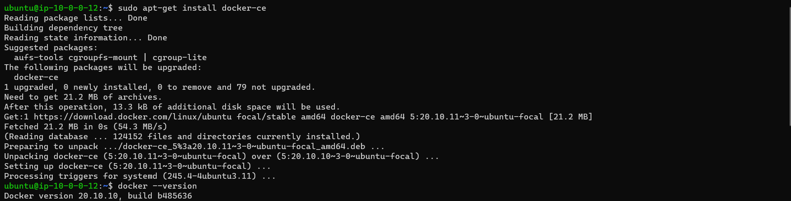
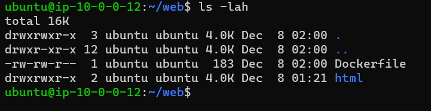
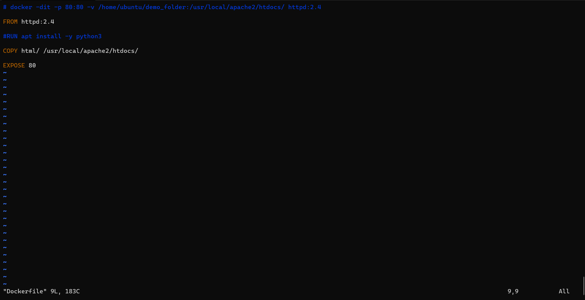

# Project 6 Documentation

# Part 1

# Installing Docker on Desktop/EC2 Instance

- To install Docker Desktop, I go to https://docs.docker.com/desktop/windows/install/ and on the page I click on 'Docker Desktop for Windows' button to download the installer.

- After completing the install, I open the Docker Desktop application and sign in to my Docker account that I already created before writing this READ ME.

- Now I am going to install Docker on my EC2 Instance w/ Ubuntu

- I first login to my EC2 instance and type in the Docker GPG key: 'curl -fsSL https://download.docker.com/linux/ubuntu/gpg | sudo gpg --dearmor -o /usr/share/keyrings/docker-archive-keyring.gpg'

- Now, we will install the latest version of Docker by typing 'sudo apt-get install docker-ce docker-ce-cli containerd.io'

# Building a Container

- As per requirements for the project, we shall build a container from a dockerfile. The image required must run Apache 2 to run a simple web page file. 

- I create a folder for my html project and make a folder within the directory for my 'index.html' file.

- I will start making a dockerfile by using 'vim Dockerfile'.

- We first add our 'FROM' parameter and we need our image to pull from Docker. For a container with Apache 2, we need to utilize 'httpd' as our image and then specify what version we need, in this case ':2.4' after the image name.

- Next is our 'COPY' parameter where we copy the contents of our folder that contains the 'index.html' file. We have to type in the proper file order that is required for Apache 2 Index files, '/usr/local/apache2/htdocs/'.

- Lastly we have our 'EXPOSE', while unneeded since we will use '-p' in the final build to open the container to all host ports, it is just proper etiquette to signify the desired port for the host to connect to the container.

- Now we save and exit with ':wq'

- Now we type out 

# Running the Container

# Viewing a Project

# Part 2

# Creating a DockerHub Public Repo

# DockerHub authentication via CLI

# Configuring GitHub secrets

# Configure GitHub Workflow

# Part 3

# Pulling the Project Image

# Running the Project Container
