# Project 6 Documentation

# Part 1

# Installing Docker on Desktop/EC2 Instance

- To install Docker Desktop, I go to https://docs.docker.com/desktop/windows/install/ and on the page I click on 'Docker Desktop for Windows' button to download the installer.

- After completing the install, I open the Docker Desktop application and sign in to my Docker account that I already created before writing this READ ME.

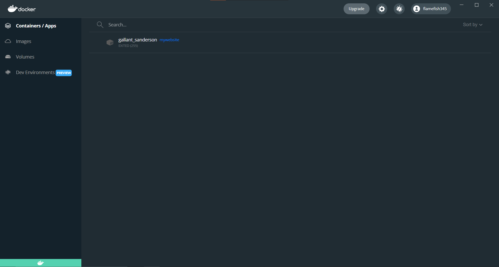

- Now I am going to install Docker on my EC2 Instance w/ Ubuntu

- I first login to my EC2 instance and type in the Docker GPG key: 'curl -fsSL https://download.docker.com/linux/ubuntu/gpg | sudo gpg --dearmor -o /usr/share/keyrings/docker-archive-keyring.gpg'

- Now, we will install the latest version of Docker by typing 'sudo apt-get install docker-ce docker-ce-cli containerd.io'

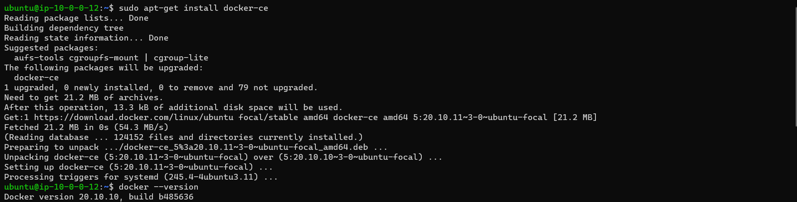

# Building a Container

- As per requirements for the project, we shall build a container from a dockerfile. The image required must run Apache 2 to run a simple web page file. 

- I go to my new repository, 'cicd-username' since that is where the Dockerfile should be placed for the project.

- I will start making a dockerfile by using 'vim Dockerfile'.

- We first add our 'FROM' parameter and we need our image to pull from Docker. For a container with Apache 2, we need to utilize 'httpd' as our image and then specify what version we need, in this case ':2.4' after the image name.

- Next is our 'COPY' parameter where we copy the contents of our folder that contains the 'index.html' file. We have to type in the proper file order that is required for Apache 2 Index files, '/usr/local/apache2/htdocs/'.

- Lastly we have our 'EXPOSE', while unneeded since we will use '-p' in the final build to open the container to all host ports, it is just proper etiquette to signify the desired port for the host to connect to the container.

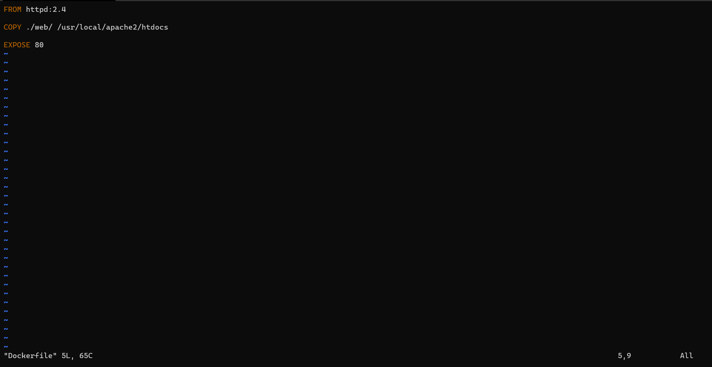

- Now we save and exit with ':wq'

# Running the Container
- We have built our Dockerfile for our http project and now we need to run the container.

- We input the command, 'docker run --rm -dit -p 8080:80 web'. This command will clean up any previous containers made with this Dockerfile, make the container run in the foreground without bringing up a terminal, and utilize port 80 on our host for the ability to view our project in browser. After entering, we will get an output of a container ID.

- We will do a quick 'docker ps -a' to check if our container is running. We will see that the container is running off of an image from our 'web/' folder, was given the command to keep running in the foreground, and that it is bound to port 80 of our host. 

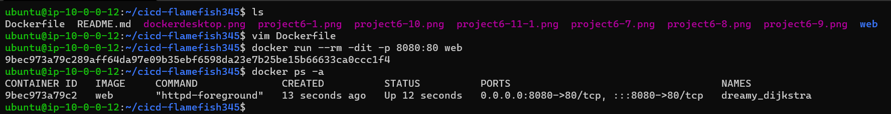

# Viewing a Project

- Now to run a couple 'tests' before we view the project in browser.

- First, we will do a quick 'ip a' to get a glimpse at our instance's ip addresses. We wanted to see our docker's ip address to test that the container is working properly.

- We'll test this on the 'loclhost' first, so we'll input the command, 'curl localhost:8080' and this will output the code from our 'index.html' file. We shall do the same for our docker's ip address, 'curl 172.17.0.1:8080' and we should see the same output.

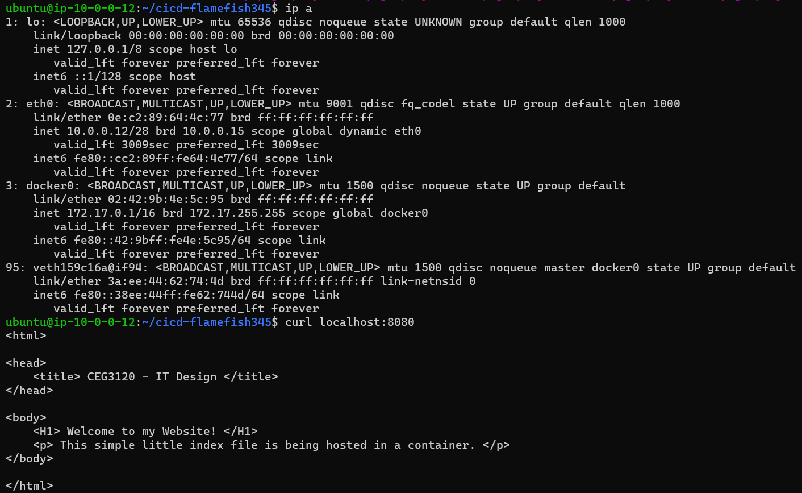

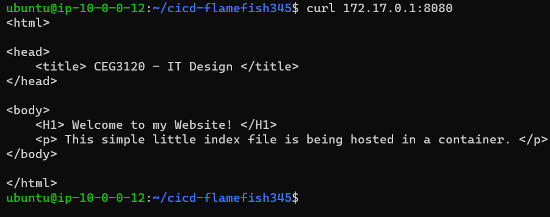

- Now to view our project in browser, we must type in the address bar our instance's public IPv4 address and the designated bound port on the host. So we type in 'PublicIPv4Address:8080'. This should give us the out of a simple web page that was made in our 'index.html' file.

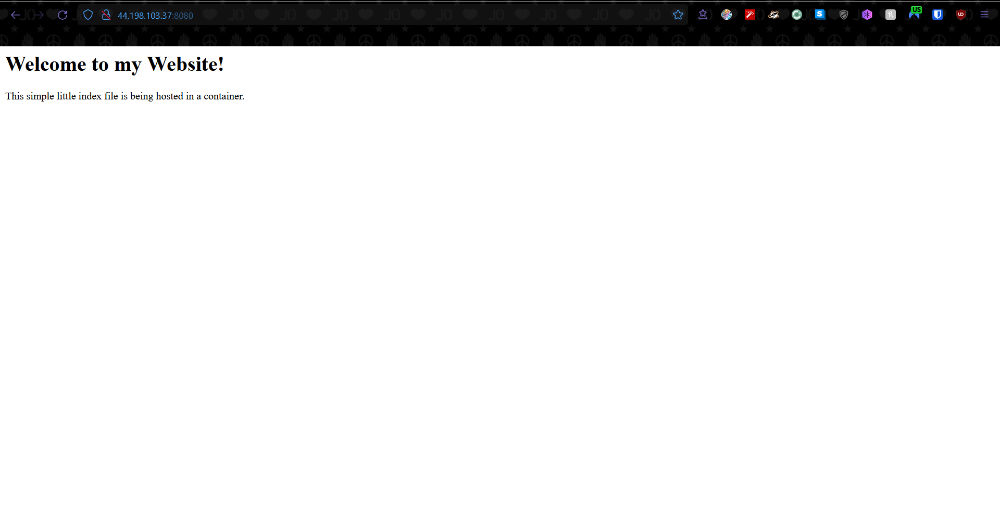

# Part 2

# Creating a DockerHub Public Repo

- We will now head over to hub.docker.com, login to our account, and then click on the section, 'Repositories'.

- Once in this section, click on 'Create a repository'.

- Next you will be brought to a section where you will give the repo a name, give an optional description, and set the repo to either public view or private view.

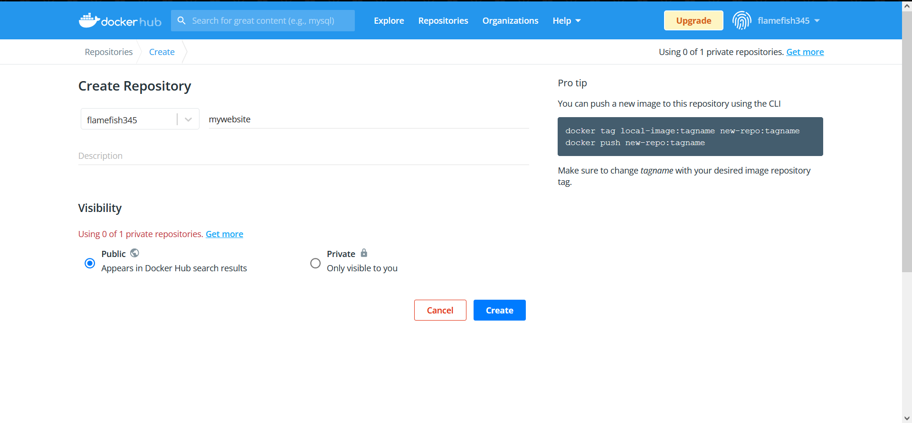

- Once you are done, click 'Create' and your next screen should be inside your repository. Something like this:

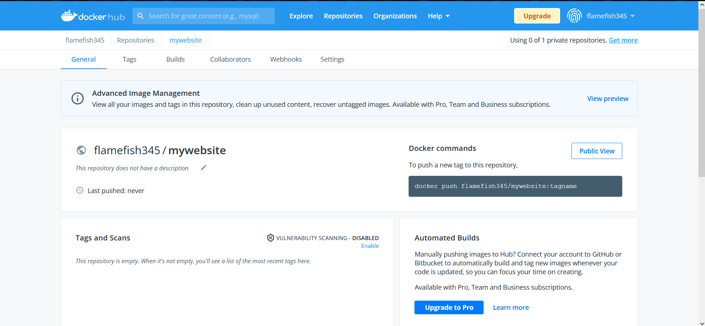

# DockerHub authentication via CLI

- Now to push containers made through our instance to the Docker repo, we need to be logged in to our Docker Hub account on the instance.

- You could easily type 'docker login --username yourusername' but there's a caveat where the password is stored on your system and this could be a potential security issue if someone got a hold of this config file.

- So we are going to create a security key via CLI authenticaton.

- First, go to your Docker Hub account settings. Once there, click on 'Security' and you should see a section called 'Access Tokens'

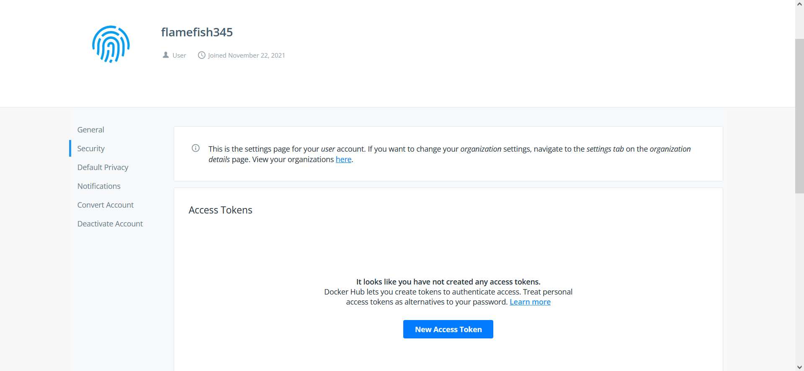

- Click on 'New Access Token' and you be presented with a menu to name your token, the priveleges your token allows to whoever uses it, in this case we'll make it 'Read, Write, & Delete'. Then finally, click 'Generate New Token'. Then it will give you a prompt to save the 'key password' somewhere secure. Once you exit, you will not be able to see this password again. So, make sure to copy this password somewhere safe.

- Your 'Access Keys' page should look something like this, with your key activated.

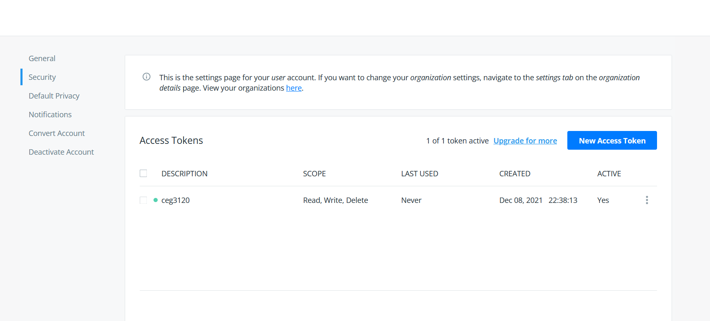

# Configuring GitHub secrets

- Before we get into GitHub Actions and configuring workflows, we will need to set up some 'Action Secrets' for GitHub to encrypt and become available for later use in future workflow files.

- Go to your repo on GitHub and click on 'Settings'.

- Scroll down until you find a selection to the side called 'Secrets' and click on it.

- This should take you to a menu called 'Action Secrets'. click on the 'New repository secret' button. Next you will be prompted to give the secret a name and then in the description, type in your secret (in this first case, the username to your Docker Hub account). Then click on 'add secret' to finish.

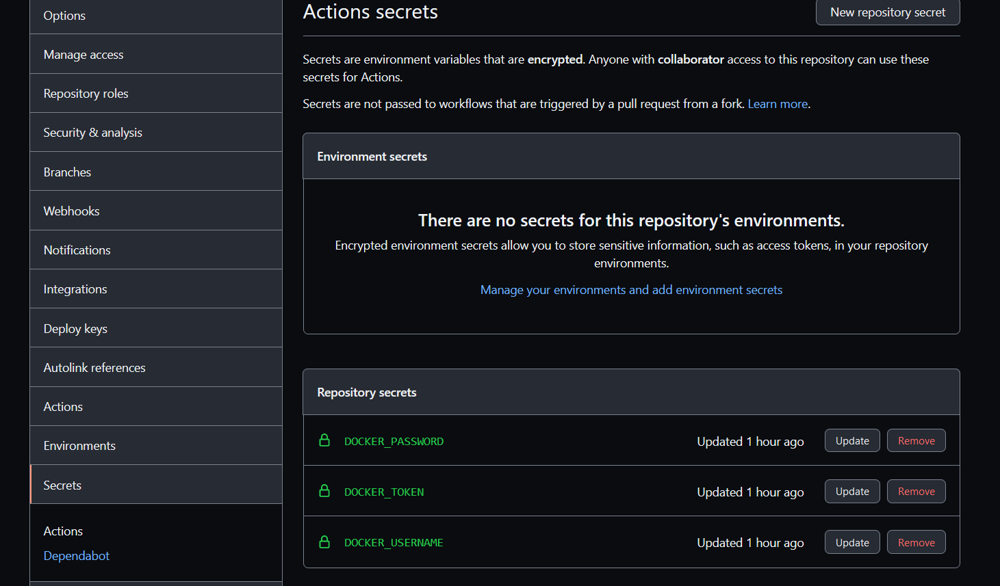

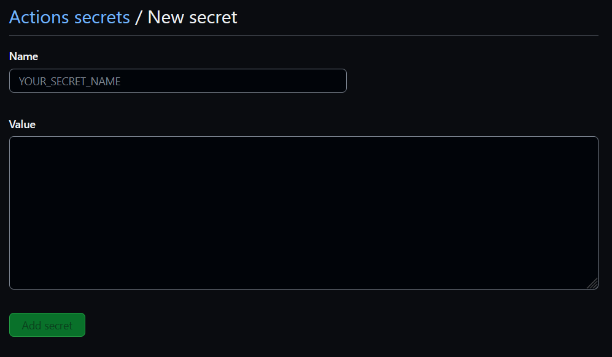

- Once you've made your first secret, repeat the previous steps twice to secure your Docker Hub login password and then a secret for the password to your Docker Hub Access Key.

- With all this done, you should have a total of three (3) secrets encrypted.

# Configure GitHub Workflow

- Now with out secrets setup, let's move onto GitHub Actions and Workflows.

- First, either on Visual Studio Code or on your EC2 Instance, go into your repo and create a folder called '.github/', then within '.github/' created another folder called 'workflows'.

- This is the proper file path for all of your workflow files if you wish for them to run properly.

- Now create a new file in '.github/workflows' with a name that represents what you want the workflow to do and then end it with '.yml' as all workflow files are in YAML format.

- Editing your '.yml' file in either vim in Ubuntu or Visual Studio Code, start off with 'name:' and give your action a name.

- Next is the 'on' section where if you want to have the action activate on either a 'pull:' or 'push:' to/from GitHub.

- Under your trigger (either 'push:' or 'pull:') you want to add a 'branch:' of where your changes will take effect once the action triggers (this case we'll stick with '[main]').

- For this workflow, we want to push an image to our Docker Hub once a git push happens. We will need to make an 'env:' or environment for our repo. We'll label this 'DOCKER_HUB_REPO:' and you give the name of the repo.

- Next is the 'jobs:' section where you will codify your processes for your action. Our job is pushing an image to a repo, so, we will type something like 'push_to_registry:' underneath 'jobs:' tab.

- Now under our job name, we will give a 'name:' to describe in short wha the job/action is.

- Next is 'runs-on:', where we select our 'runner' for our image. We will be making an Ubuntu image that is the latest version, so, we will type 'ubuntu-latest'.

- Now for 'steps:' where the order of instructions taken to perform the action will take place. You will give each step a 'name:' and it's purpose or 'uses:'.

- The first step is 'actions/checkout@v2' which is version 2 of the 'actions/checkout' action where it checks out the designated repo and makes it available your runner to perform scripts within the designated repo.

- Final step is to push the image to docker hub. So the 'uses:' are 'docker/build-push-action@v1' which is version 1 of thr docker build & push action where it will build our runner into an image and push the image into the repository.

- Next is the 'with:' section were we put in the login credentials for our Docker Hub account, the destination of our repo, and any proper tags for Docker to recognize.

- This requires your 'username:' which will then place '${{ secrets.name-of-username-secret}}' this will allocate your Action Secret from eariler that you labeled as your username for Docker Hub.

- Next is the 'password:' which is again '${{ secrets.name-of-password-secret}}' which will utilize your password Action Secret. For this case, we can use either the login password or the more secure access key password.

- Next is the 'repository:' where your 'env:' that was made at the start of our '.yml' file is placed. Coded as '${{ env.name-of-environment }}', this is the destination for your image.

- Finally we end with our 'tags_with_ref:', in this case we put 'true'.

- Your final '.yml' file should look something similar to this:

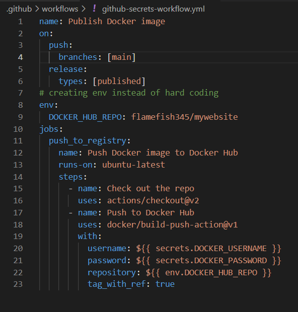

- With this committed and pushed to your repo, head back to your repo, select actions, then select the workflow 'Publish Docker Image' and click on your push request (should be the same as your committ message).

- Now you should be a section for your 'Push Docker Image' action. Click on the job that we named 'Push docker image to docker hub' and this should give a summary of each step in your workflow and all of the post processes after the action finishes.

- Note: this may take a few seconds depending on your connection for the action to finish. There may also be a warning at the bottom of your job's screen saying that 'docker-build-push@v2' is available but that is fine for case.

- We will now double check over on our Docker Hub repo to make sure that the new image was added:

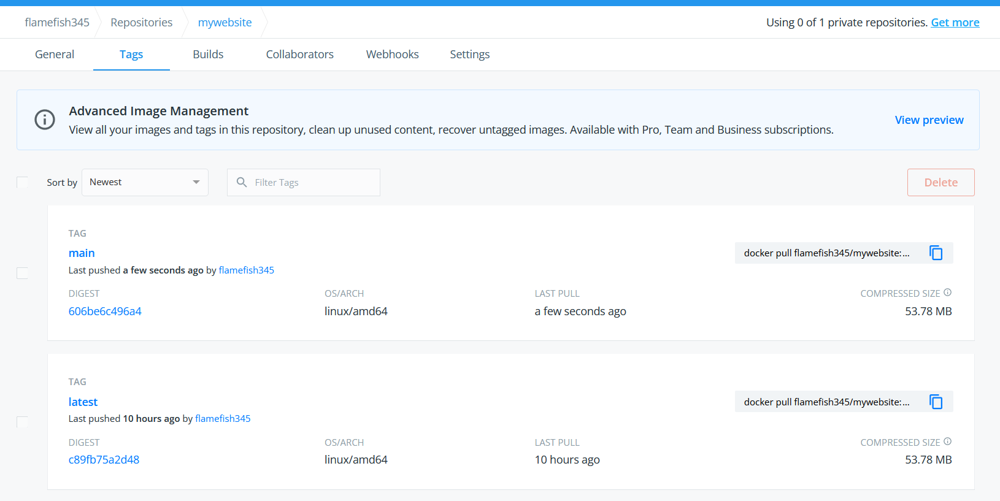

# Part 3

# Pulling the image

- We will now run the image from our Docker Repo in our AWS Instance.

- First we need to login to our Docker Hub account with either your password or access key:

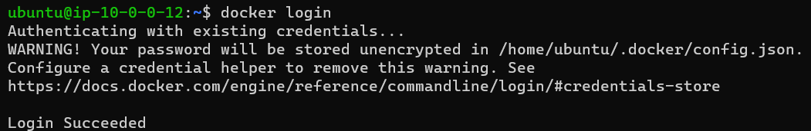

- We have created the image eariler when we pushed our first image from the beginning to Docker Hub and now we will pull that pushed image by running it.

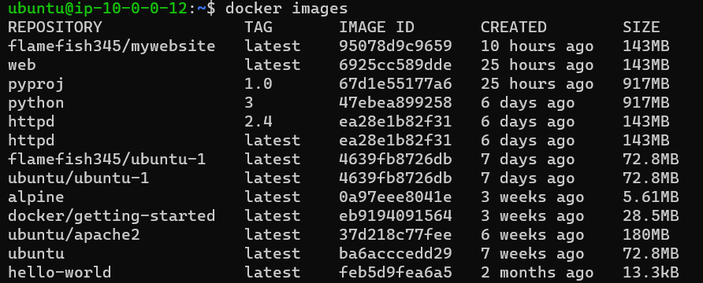

# Running the container

- We will run the docker image with 'docker run -dit -p 8080:80 name-of-docker-image'. This should, like eariler, output a container id.

- To make sure it's running, we'll do a quick 'docker ps' should see that the container is running in the foreground and bound to port 80.

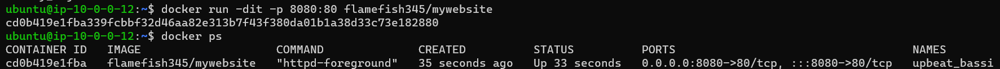

- Now to show our container through the browser. Let's run a quick 'curl ipinfo.io' to get our Instance's public IPv4 address.

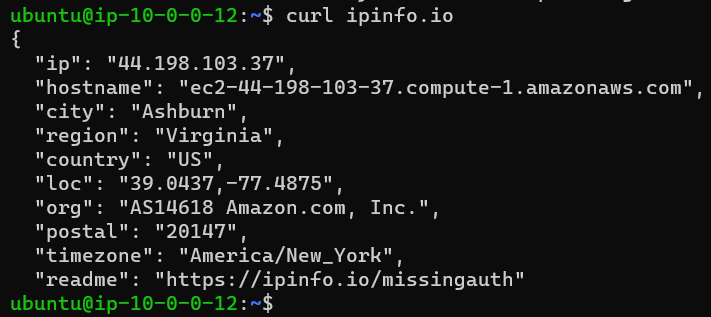

- Now go to your browser and type 'AWS-Instance-Public-IP:8080' in the address bar and hit enter. Your webpage should load as coded in 'index.html'.

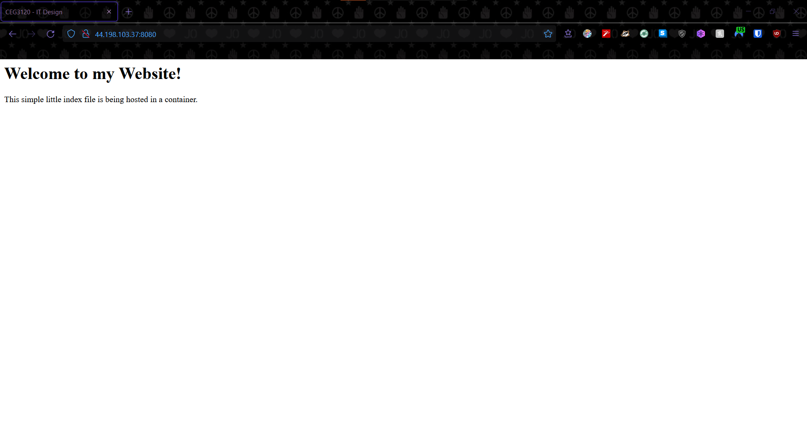

