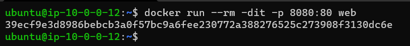
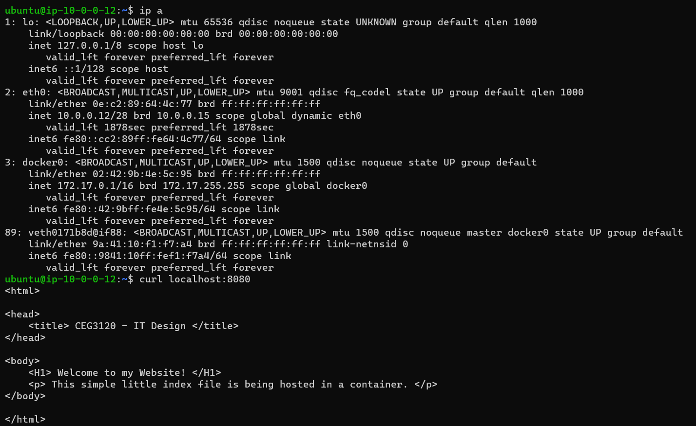
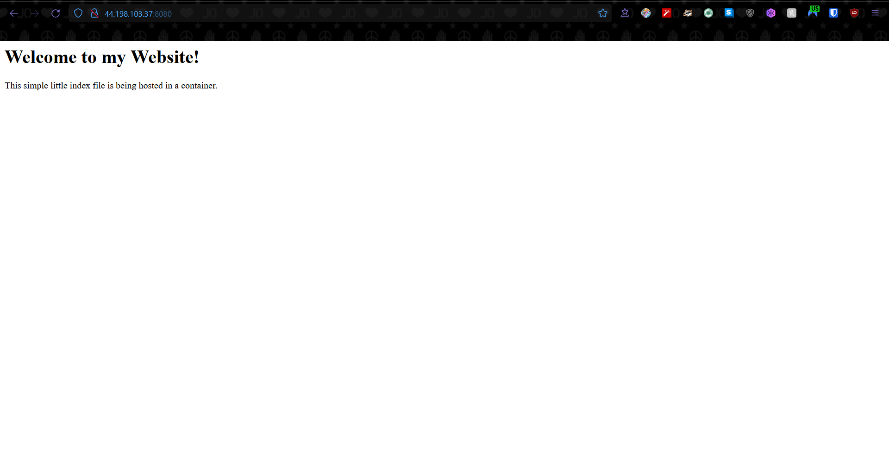

# Project 6 Documentation

# Part 1

# Installing Docker on Desktop/EC2 Instance

- To install Docker Desktop, I go to https://docs.docker.com/desktop/windows/install/ and on the page I click on 'Docker Desktop for Windows' button to download the installer.

- After completing the install, I open the Docker Desktop application and sign in to my Docker account that I already created before writing this READ ME.

- Now I am going to install Docker on my EC2 Instance w/ Ubuntu

- I first login to my EC2 instance and type in the Docker GPG key: 'curl -fsSL https://download.docker.com/linux/ubuntu/gpg | sudo gpg --dearmor -o /usr/share/keyrings/docker-archive-keyring.gpg'

- Now, we will install the latest version of Docker by typing 'sudo apt-get install docker-ce docker-ce-cli containerd.io'

# Building a Container

- As per requirements for the project, we shall build a container from a dockerfile. The image required must run Apache 2 to run a simple web page file. 

- I go to my new repository, 'cicd-username' since that is where the Dockerfile should be placed for the project.

- I will start making a dockerfile by using 'vim Dockerfile'.

- We first add our 'FROM' parameter and we need our image to pull from Docker. For a container with Apache 2, we need to utilize 'httpd' as our image and then specify what version we need, in this case ':2.4' after the image name.

- Next is our 'COPY' parameter where we copy the contents of our folder that contains the 'index.html' file. We have to type in the proper file order that is required for Apache 2 Index files, '/usr/local/apache2/htdocs/'.

- Lastly we have our 'EXPOSE', while unneeded since we will use '-p' in the final build to open the container to all host ports, it is just proper etiquette to signify the desired port for the host to connect to the container.

- Now we save and exit with ':wq'

# Running the Container
- We have built our Dockerfile for our http project and now we need to run the container.

- We input the command, 'docker run --rm -dit -p 8080:80 web'. This command will clean up any previous containers made with this Dockerfile, make the container run in the foreground without bringing up a terminal, and utilize port 80 on our host for the ability to view our project in browser. After entering, we will get an output of a container ID.

- We will do a quick 'docker ps -a' to check if our container is running. We will see that the container is running off of an image from our 'web/' folder, was given the command to keep running in the foreground, and that it is bound to port 80 of our host. 

# Viewing a Project

- Now to run a couple 'tests' before we view the project in browser.

- First, we will do a quick 'ip a' to get a glimpse at our instance's ip addresses. We wanted to see our docker's ip address to test that the container is working properly.

- We'll test this on the 'loclhost' first, so we'll input the command, 'curl localhost:8080' and this will output the code from our 'index.html' file. We shall do the same for our docker's ip address, 'curl 172.17.0.1:8080' and we should see the same output.

- Now to view our project in browser, we must type in the address bar our instance's public IPv4 address and the designated bound port on the host. So we type in 'PublicIPv4Address:8080'. This should give us the out of a simple web page that was made in our 'index.html' file.

# Part 2

# Creating a DockerHub Public Repo

# DockerHub authentication via CLI

# Configuring GitHub secrets

# Configure GitHub Workflow

# Part 3

# Pulling the Project Image

# Running the Project Container
