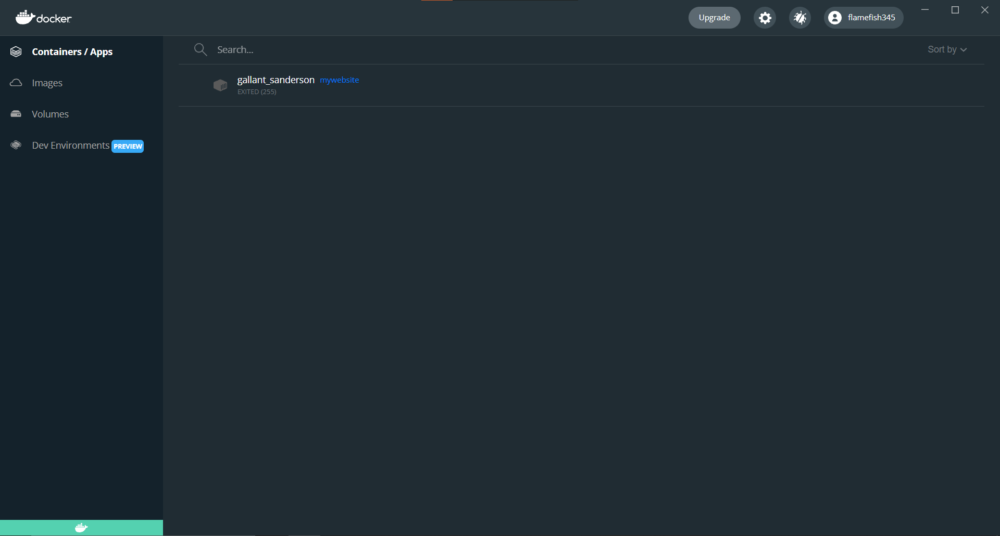

# Project 6 Documentation

# Part 1

# Installing Docker on Desktop/EC2 Instance

- To install Docker Desktop, I go to https://docs.docker.com/desktop/windows/install/ and on the page I click on 'Docker Desktop for Windows' button to download the installer.

- After completing the install, I open the Docker Desktop application and sign in to my Docker account that I already created before writing this READ ME.

- Now I am going to install Docker on my EC2 Instance w/ Ubuntu

- I first login to my EC2 instance and type in the Docker GPG key: 'curl -fsSL https://download.docker.com/linux/ubuntu/gpg | sudo gpg --dearmor -o /usr/share/keyrings/docker-archive-keyring.gpg'

# Building a Container

# Running the Container

# Viewing a Project

# Part 2

# Creating a DockerHub Public Repo

# DockerHub authentication via CLI

# Configuring GitHub secrets

# Configure GitHub Workflow

# Part 3

# Pulling the Project Image

# Running the Project Container
